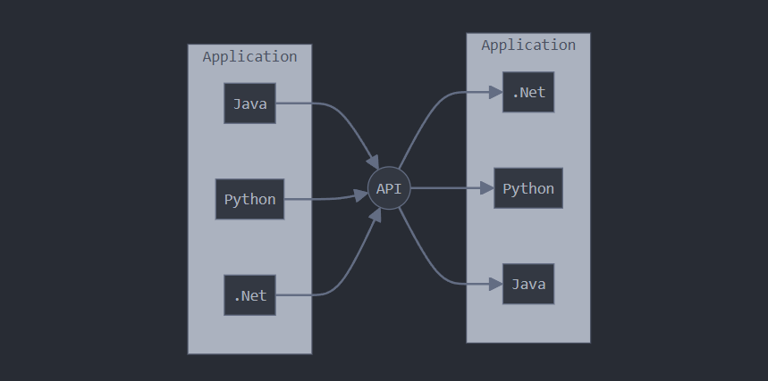

### **Django Rest Framework**  

1. Most people don’t know about this exciting technology.  
2. It is a must-have technology. A Django application without a REST API is like a human without hands and legs.  
3. It is a very easy technology.  
4. It is a very small technology.  

### **Topics Covered**  
1) API  
2) Web API/Web Service  
3) REST  
4) REST API  
5) Django Rest Framework  

### **API**  
**API → Application Programming Interface**  

The main purpose of an API is to allow two applications to communicate with each other.  
It enables an external system to **integrate and exchange information** with our application.  

**In simple words:** "A method for different software components to communicate."  

**Examples:**  
- A Java application can communicate with a Python application using an API.  
- The BookMyShow app can connect with a payment gateway to complete bookings.  
- Logging in with Facebook is also done through an API.  

**Note:**  
The **interface of communication** between a user and an application is called an **API**.  
The user can be a **human, an Android app, or a desktop application**, etc.  

### **Web API / Web Service**  
When the **communication happens over the web using HTTP**, it is called a **Web API** or **Web Service**.  

### **REST (Representational State Transfer)**  
REST is an **architectural style** that defines several **rules and guidelines** for developing Web APIs/Web Services.  

With REST, we can develop **Web APIs in a simple and efficient way**.  
That’s why REST is the **most popular architecture** for web services.  

### **RESTful API**  
A **RESTful API** is an API that follows **REST architecture**.  
It acts as an interface between the user and the application while following REST principles.  

**Note:**  
- **REST is an architecture.**  
- **RESTful API is an API that implements REST.**  

### **Django Rest Framework (DRF)**  
Django REST Framework (DRF) is a **powerful and flexible toolkit** for building Web APIs.  
It is the **most widely used** framework in Python for building Web APIs.  

It is built on top of Django and internally uses all Django features like:  
- Models  
- Views  
- Templates  
- ORM (Object-Relational Mapping)  

**Website:** [Django REST Framework](https://www.django-rest-framework.org/)  

### **Current Version**  
- Django REST Framework: **3.14.0**  

### **Requirements**  
- **Python:** 3.7, 3.8, 3.9, 3.10, 3.11  
- **Django:** 3.2, 4.0, 4.1, 4.2  

<p align="center">
  
</p>


---
### **Web Services**  

By using **Web Services**, any application in the world can communicate with any other  
application, irrespective of **programming language** (Java, Python, .NET, etc.) and **platform** (Windows, Linux, macOS, etc.).  

The applications communicate using **HTTP Protocol** as the common language.  
The message format can be **XML** or **JSON**.  

### **API**  
- An API allows access to the functionality of any application.  
- It can be a **standalone application, web application, or enterprise application**.  

### **Web API / Web Service**  
- A **Web API/Web Service** provides access to a web application's functionality using **HTTP**.  

### **REST (Representational State Transfer)**  
- REST is an **architecture** that provides several **guidelines** to develop web APIs easily and effectively.  

### **RESTful API**  
- A **RESTful API** is a Web API that follows **REST principles**.  

### **Django REST Framework**  
- Django REST Framework provides a **toolkit** to develop RESTful APIs for Django-based applications **easily**.  
- The main objective of web APIs is **interoperability**, meaning different applications can communicate **regardless of programming language or platform**.  
- The common communication language is: **HTTP**  
- The common message format is: **XML/JSON**  

### **Why JSON Over XML?**  
- The most common data format in web APIs is **JSON (JavaScript Object Notation)**.  
- JSON is a **collection of key-value pairs**, similar to Python dictionaries.  

#### **Example JSON Data Format:**  
```json
{
    "eno": 100,
    "ename": "Durga",
    "esal": 1000,
    "eaddr": "Hyd"
}
```  
**Advantages of JSON over XML:**  
- **Machine-friendly and Human-friendly** format.  
- Easier to read and parse compared to XML.  
 

---

### **HTTP Verbs**  

HTTP Verbs define the type of operation we need to perform.  
Based on the requirement, we should use the appropriate HTTP verb.  

The following are the most commonly used **HTTP Verbs**:  

1) **GET** → Used to retrieve one or more existing resources.  
2) **POST** → Used to create a new resource.  
3) **PUT** → Used to update an existing resource (e.g., updating all fields of an employee).  
4) **PATCH** → Used for partial updates (e.g., updating only the salary of an employee).  
5) **DELETE** → Used to delete an existing resource.  

**Note:** The following HTTP verbs exist but are **not commonly used**:  
- OPTIONS  
- HEAD  
- CONNECT  
- TRACE  
- LOCK  
- MOVE  
- PROPFIND  
- etc.  

### **HTTP Verbs vs Database CRUD Operations**  

| CRUD Operation  | HTTP Verb |
|----------------|----------|
| **Create**    | POST     |
| **Read**      | GET      |
| **Update**    | PUT/PATCH |
| **Delete**    | DELETE   |  


### **Types of Web Services**  
There are **two types** of web services:  

1) **SOAP-Based Web Services**  
2) **RESTful Web Services**  

---

### **1) SOAP-Based Web Services**  
- **SOAP**: Simple Object Access Protocol.  
- SOAP is an **XML-based protocol** for accessing web services.  
- To describe SOAP-based web services, we use **WSDL** (Web Service Description Language).  
- SOAP-based web services are **more secure** and can be consumed using **RPC method calls**.  
- They support multiple protocols like **HTTP, SMTP, FTP**, etc.  

#### **Limitations of SOAP-Based Web Services**  
1) SOAP-based web services **always provide data in XML format**. XML parsing is **slow**, leading to **performance issues**.  
2) **Transferring XML data** over a network requires **more bandwidth**.  
3) **Implementing SOAP-based web services is complex**.  

**Note:** Due to **high resource usage, low performance, and high bandwidth requirements**, SOAP-based web services are **not commonly used** today.  

---

### **2) RESTful Web Services**  
- **REST** stands for **Representational State Transfer**. Each **unique URL** represents an object.  
- **Operations on RESTful Web Services:**  
  - Retrieve data → **GET**  
  - Create new data → **POST**  
  - Update data → **PUT/PATCH**  
  - Delete data → **DELETE**  
- RESTful web services **mostly provide data in JSON format**, making **parsing easier and faster** than XML-based SOAP services.  
- JSON data **requires less bandwidth** compared to XML.  

#### **Limitations of RESTful Web Services**  
1) **Less secure** compared to SOAP.  
2) Supports **only protocols that provide a URI**, mostly **HTTP**.  

**Note:** Due to its **lightweight nature, high performance, lower bandwidth requirements, easy development, and human-readable message format**, RESTful web services are **the most commonly used web services today**.  

---

### **Differences Between SOAP and REST**  

| **SOAP** | **REST** |
|----------|---------|
| 1) **XML-based message protocol**. | 1) **An architectural style, not a protocol**. |
| 2) Uses **WSDL** for communication between consumer and provider. | 2) Uses **XML/JSON** for sending and receiving data. |
| 3) Invokes services using **RPC method calls**. | 3) Invokes services using **simple URL paths**. |
| 4) **Does not return human-readable results**. | 4) **Returns human-readable results** (XML or JSON). |
| 5) **Heavyweight**. | 5) **Lightweight**. |
| 6) **Requires more bandwidth**. | 6) **Requires less bandwidth**. |
| 7) Supports **multiple protocols** (HTTP, SMTP, FTP, etc.). | 7) Supports **only protocols that provide a URI**, mostly **HTTP**. |
| 8) **Low performance**. | 8) **High performance**. |
| 9) **More secure**. | 9) **Less secure**. |

**Note:**  
- **Most of Google's web services use SOAP**.  
- **Yahoo uses RESTful Web Services**.  
- **eBay and Amazon support both SOAP and RESTful Web Services**.  

---
### **Web Service Provider vs Web Service Consumer**  

- The application that **provides** web services is called a **Web Service Provider**.  
- The application that **consumes** data through web services is called a **Web Service Consumer**.  

#### **Example:**  
**BookMyShow App** ↔ **Payment Gateway App**  

To complete a booking, the **BookMyShow application** communicates with the **Payment Gateway application**.  
- The **Payment Gateway application** acts as the **Web Service Provider**.  
- The **BookMyShow application** acts as the **Web Service Consumer**.  
